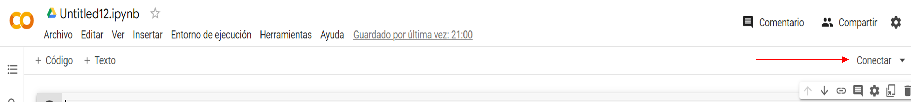
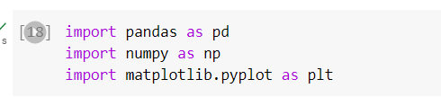
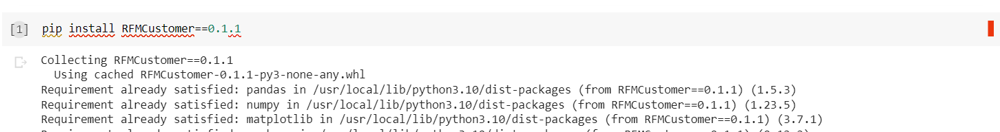

<div>
    <a href="https://www.linkedin.com/in/sebastianurdaneguibisalaya/">
        
    </a>
    <a href="https://medium.com/@sebasurdanegui">
        
    </a>
    
    
    
    
<div>


# **Segmentación RFM** 📊🤓
El presente repositorio tiene como objetivo la creación y explicación del funcionamiento de la librería ***RFMSegmentation*** 📊 en Python que es capaz de recibir input de las transacciones comerciales de los clientes para retornar como output una segmentación RFM para la óptima toma de decisiones empresariales.

## **Teoría Segmentación RFM**
**RFM** (Recency, Frequency and Monetary). Básicamente, es un score para la segmentación de los consumidores enfocado en el análisis de la compra reciente, la frecuencia y el monto de la compra por parte del cliente. 🛒 **En líneas generales, su función es utilizar los patrones de consumo del cliente para identificar el segmento al cual pertenece 🧑‍🤝‍🧑**. 

**Contexto para el ejemplo:**

La empresa desea realizar una segmentación RFM y toma como fecha de corte el 14 de agosto de 2023.
Sebastian es cliente de SportShoes S.A.C. Él realizó su última compra el 8 de agosto de 2023. Desde que realizó la primera compra del producto de la empresa hasta la fecha de corte, Sebastian realizó 9 compras con un monto total de S/. 5,000.00. 

1. **Recency** 
   
   ¿Hace cuánto el cliente realizó su última compra?
   
   ***Ejemplo:*** Sebastian realizó su última compra hace 6 días.
2. **Frequency**
   
   ¿Cuál es la frecuencia de compra del cliente?

   ***Ejemplo:***  Sebastian tiene una cantidad de órdenes total de 9 veces.
3. **Monetary**
   
   ¿Cuánto dinero gastó el cliente en sus compras en el establecimiento?

   **Ejemplo:** Sebastian gastó en total S/. 5,000.00 en la compra de productos de la empresa SportShoes S.A.C. (En ocasiones, suele usarse el promedio de los montos de compra.)

## **Pasos para el uso de la librería RFMSegmentation**

Pueden descargar el dataset que utilice de ejemplo desde mi perfil de GitHub haciendo clic <a href="https://github.com/SebastianUrdaneguiBisalaya/Segmentacion-RFM/tree/main/data">aquí</a>:

1. Abrir un notebook en Google Colab (también puedes usar VSCode, Anaconda o cualquier IDE). <a href="https://colab.research.google.com/?hl=es">Clic aquí</a>
2. Luego de abrir el entorno de Google Colab, debemos inicializar el entorno e importar las librerías.
<div>

</div>

```python
import pandas as pd
import numpy as np
import matplotlib.pyplot as plt
```

<div>

</div>

1. Después, debemos instalar la librería **RFMCustomer**
```python
pip install RFMCustomer==0.1.1
```
<div>

</div>

### **¡Perfecto, podemos hacer uso de la librería!**


En este caso, tengo un dataset con los siguientes nombre de columnas:
```python
Columnas del dataset
Index(['Row ID', 'Order ID', 'Order Date', 'Ship Date', 'Ship Mode',
'Customer ID', 'Customer Name', 'Segment', 'Country', 'City', 'State',
'Postal Code', 'Region', 'Product ID', 'Category', 'Sub-Category',
'Product Name', 'Sales'],
      dtype='object')
```
En general, nuestro dataset puede tener n-columnas. No obstante, es escencial que se cuente con las columnas que hagan referencia a la identificación del consumidor **(en el presente caso, la columna es Row ID)**, el día en que se ejecutó la venta del producto  o el día en que se generó la fecha de orden **(Order Date)**, una columna de venta total (precio por cantidad) por registro **(Sales)**, en el caso no se cuente la columna de venta total se debe generar una columna producto entre el precio de venta y la cantidad.

Luego, esas columnas escenciales pueden estan nombradas de diferente forma pero es necesario que renombremos esas columnas para hacer el uso de los módulos que se derivan de la clase **RFMCustomer**.

Es preciso mencionar que la clase RFMCustomer requiere de 4 nombre de columnas escenciales: **Order ID**, **Date**, **Customer ID** y **Sales**.
Recalco, sí o sí se deben tener estos nombres asignados en las columnas. Le asigno el nombre de columna **Order ID** a la columna que haga referencia al ID del registro de transacción o cualquier columna que no tenga valores nulos.

Dado que nuestro dataset cumple con los nombres de las columnas requeridas por la librería excepto por la columna **Order Date** que debería decir **Date** y hace referencia a la fecha del registro de la transacción comercial o día del pedido, debemos renombrarla.

Te brindo un ejemplo del código en Python
para renombrar columnas:

```python
data = data.rename(columns = {
    'Order Date' : 'Date
})
```

Después, debemos tomar la columna **Date** y convertirla al formato fecha ***yyyymmdd*** requerido por la librería. De la siguiente forma:
```python
data["Date"] = pd.to_datetime(data["Date"]).dt.strftime("%Y%m%d")
```
## Terminado el preprocesamiento de los datos, empezamos con el análisis

1. **Importar la librería**

```python
from RFMCustomer.RFMCustomer import CustomerSegmentation
```

2. **Obtener el dataframe con la Segmentación RFM analizada**

```python
df = CustomerSegmentation.RFMCustomer(data, '20190115', [1,2,5,17])
df
```

**CustomerSegmentation.RFMCustomer()** recibe 3 parámetros:

• **dataframe:** El dataframe que contiene los datos.

• **day:** Indicar en formato string ('yyyymmdd') la fecha máxima hasta donde se desea analizar la información.

• **positions:** Brindar una lista con los índices en el cual se encuentran las columnas requeridas por la librería. **Tener en cuenta que se inicia el conteo desde el índice 0.** En el presente caso, **Order ID** se encuentra en la posición 1, **Order Date** en la posición 2, **Customer ID** en la posición 5 y **Sales** en la posición 17.

3. **Visualización del porcentaje de clientes por segmento**

```python
segmentation_plot = CustomerSegmentation.RFMAnalysis(df)
segmentation_plot
```

4. **Visualización de la tabla que hace referencia a las medidas de resumen de RFM**

```python
segmentation_table = CustomerSegmentation.RFMTable(df, True)
segmentation_table
```
El módulo **CustomerSegmentation.RFMTable()** recibe 2 parámetros: 

• **rfm:** El dataframe **df** que asignamos en el paso 2.

• **color_gradient:** True si se requiere que la tabla sea coloreada en función de los datos y False si no se requiere colorear. Por defecto, el valor boolean es False.

5. **Obtener la tabla con los clientes que pertenecen a una clase específica.**
   
```python
segmentation_obs = CustomerSegmentation.RFMFindClientsBySegment(df, "Can't looser")
segmentation_obs
```

6. **Visualización general de la recencia, frecuencia y cantidad monetaria promedio por segmento**

```python
general_plot = CustomerSegmentation.RFMAnalysisByCategory(segmentation_table)
```

**Atento ante alguna observación o duda, por favor escribir al correo sebasurdanegui@gmail.com**


